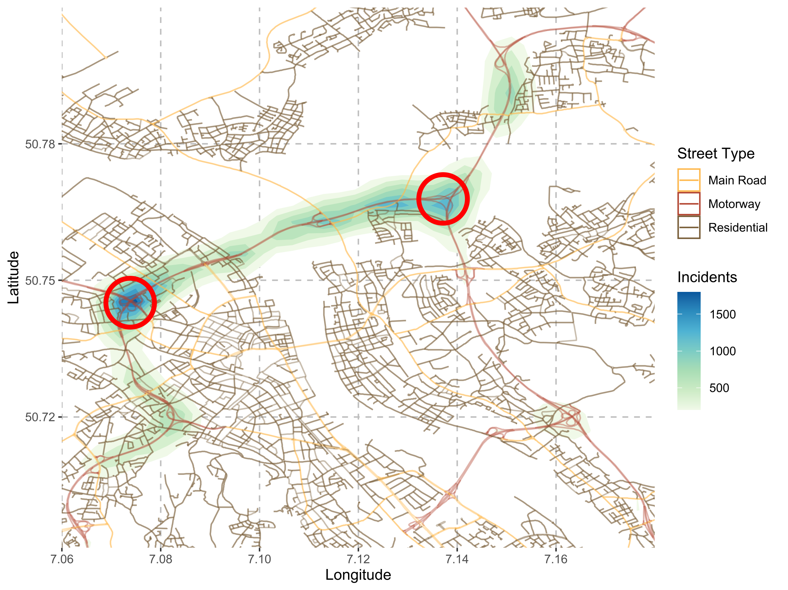
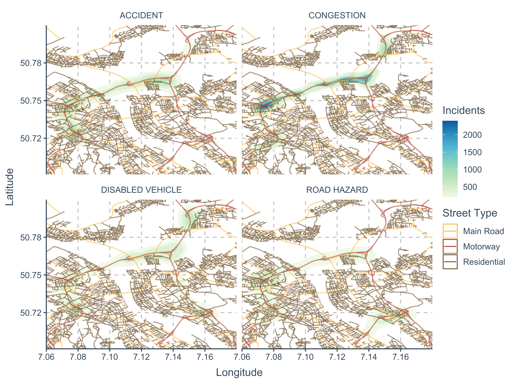
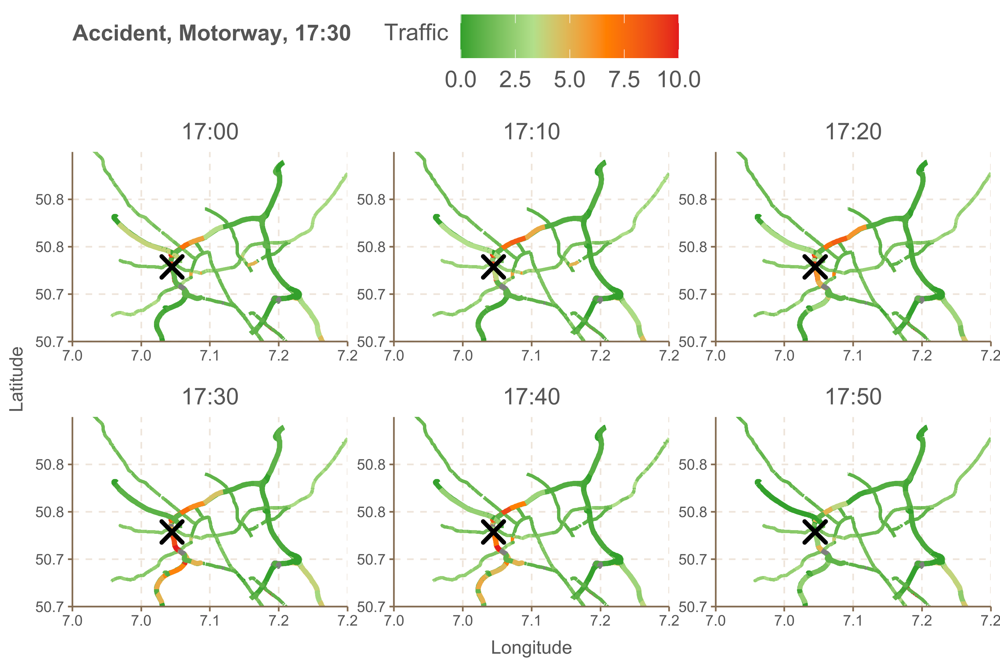

# Incident Data Characterization

This file shows a characterization of the incident data from the city of Bonn.

## Incident Overview

First, we provide some general incident-related statistics that
are given in the table below. It provides the number of different incidents for
various street types, including information about the average and maximum duration.
Based on this analysis, the amount of congestion reports surpasses the number of all other reports.
Moreover, the majority of incidents occurs on motorways, with a proportion around 90% and there is a 
noticeable difference in the duration of the different incident types.

<table>
    <thead>
        <tr>
            <th>Incident Type</th>
            <th>Street Type</th>
            <th>Entries</th>
            <th>Duration (avg.)</th>
            <th>Duration (max.)</th>
        </tr>
        <tr>
            <td>Accident   Accident   Accident</td>
            <td>Main Road   Motorway   Residential</td>
            <td align="right">4 (01.48%)   260 (95.94%)   7 (02.58%)</td>
            <td align="right">10.00 min   15.92 min   25.71 min</td>
            <td align="right">10 min   170 min   120 min</td>
        </tr>
        <tr>
            <td>Congestion   Congestion   Congestion</td>
            <td>Main Road   Motorway   Residential </td>
            <td align="right">326 (07.37%)   3892 (88.03%)   203 (04.59%)</td>
            <td align="right">12.98 min   19.15 min   11.43 min</td>
            <td align="right">90 min   730 min   50 min</td>
        </tr>
        <tr>
            <td>Disabled Vehicle   Disabled Vehicle   Disabled Vehicle</td>
            <td>Main Road   Motorway   Residential </td>
            <td align="right">9 (02.58%)   328 (93.98%)   12 (03.44%)</td>
            <td align="right">10.00 min   15.88 min   18.33 min</td>
            <td align="right">10 min   210 min   60 min</td>
        </tr>
        <tr>
            <td>Road Hazard   Road Hazard   Road Hazard</td>
            <td>Main Road   Motorway   Residential </td>
            <td align="right">11 (02.49%)   412 (93.42%)   18 (04.08%)</td>
            <td align="right">10.91 min   15.29 min   18.33 min</td>
            <td align="right">20 min   110 min   110 min</td>
        </tr>
    </thead>
</table>

Figure 1 shows a set of bar plots illustrating the distribution of incidents for different times of the day, 
separated by each individual street type. As depicted by the red and black bars, the majority of incidents does
occur during the daytime (morning and afternoon), with a noticeable difference between the type of incidents. A 
predictable incident type (e.g., congestion) is almost solely reported during the daytime, whereas unpredictable events
occasionally are reported during the night and evening.

<figure>    
    
    <figcaption> Figure 1: Incidents based on street types and time of the day</figcaption>
</figure>

In addition, we measure the occurrences of incidents based on weather condition and season of the year. The bar plots
in Figure 2 show the distribution of incident types for three different seasons: Winter, Spring and Summer. A main 
conclusion drawn from this analysis is made according the ’worse’ types of weather (rain and snow) being more present
in winter. In general this shows that there is a minor correlation between the weather and certain types of incidents.

<figure>    
    
    <figcaption> Figure 2: Incidents based on weather and season of the year</figcaption>
</figure>

## Spatiotemporal Visualization

The following figures support the analysis of incident information 
regarding a spatiotemporal aspect.

Figure 3 visualizes the density of all incidents in a spatial way, with a unique color scheme to illustrate the 
individual street types. As visible, most incidents are occurring on the motorway areas, mainly at the two main
interchanges Bonn-Nord (red circle on the left) and Bonn-Nordost (red circle on the right), indicated through the
high density level. Both interchanges serve as a crucial part of the transportation system, connecting several 
motorways that connect the cities of Bonn and Cologne, daily used by many road users. Therefore, these areas should be 
considered for potential traffic optimizations, given the significant higher amount of incident occurrences.

<figure>    
    
    <figcaption> Figure 3: Density of all incidents</figcaption>
</figure>

Additionally, Figure 4 shows the same information with the additional facet of individual incident types. Therefore, each
type of incident has a unique distribution in terms of space, visualized by the minor change in coverage from each
respective density layer. However, the majority of incidents does occur on different motorway locations, independent on 
the type of incident.

<figure>    
    
    <figcaption> Figure 4: Density of different incident types</figcaption>
</figure>

Finally, we analyze the effects of an incident on the surrounding area in Figure 5, visualizing an accident (marked by 'X'),
that happened on a motorway at 17:30. Additionally, the figure provides information regarding the traffic level of the 
surrounding roads over time. There is a visible increase of traffic on the directly connected areas surrounding the 
accident location, starting around 10 minutes before the incident is reported by the respective source. At the time of 
accident, we can notice a certain impact on the traffic behaviour of many neighboring roads, showing an increased traffic
level. This shows the correlation of traffic features in order to classify incidents based on traffic patterns and motivates
the creation of the incident classification model, based on the fused information provided through DataFITS.

<figure>    
    
    <figcaption> Figure 5: Incident effect on traffic behavior</figcaption>
</figure>